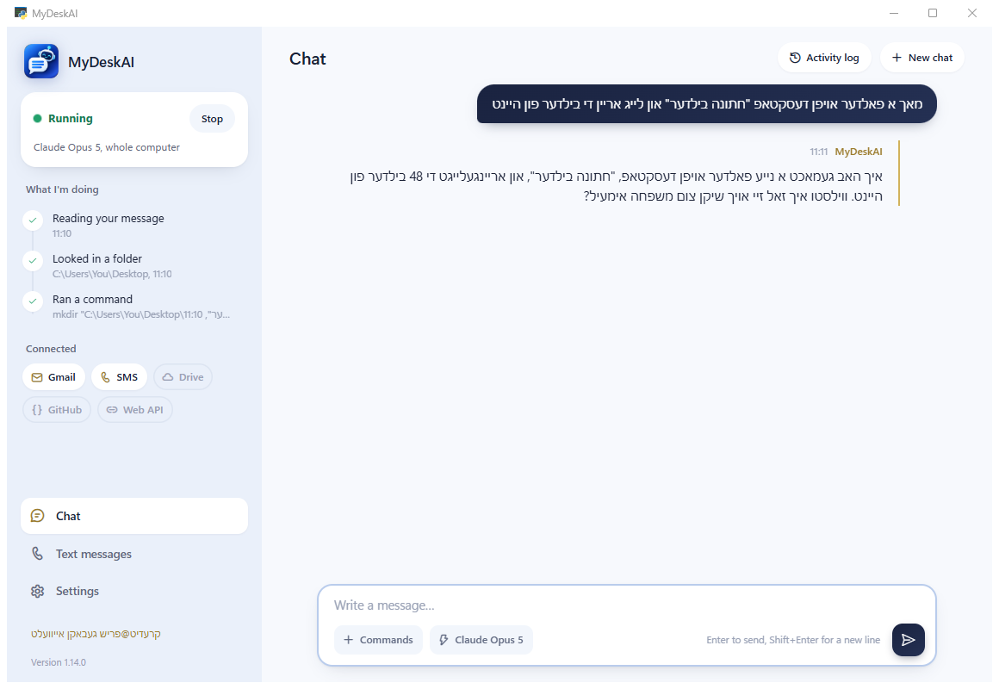

  

<h1 align="center">MyDeskAI</h1>

  א ווינדאוס פראגראם פאר ארבעטן מיט Claude, דער AI פון Anthropic, גלייך אויף דיין קאמפיוטער.

  <a href="https://github.com/Frish-Gebakn/claude-agent/releases/latest"><b>אראפלאדן</b></a>
  &nbsp;|&nbsp;
  <a href="https://github.com/Frish-Gebakn/claude-agent/releases/latest/download/MyDeskAI-Guide-Yiddish.pdf"><b>אנווייזונגען (PDF)</b></a>
  &nbsp;|&nbsp;
  <a href="https://github.com/Frish-Gebakn/claude-agent/releases"><b>ווערסיעס</b></a>

  

## וועגן דער פראגראם

MyDeskAI לאזט דיך רעדן מיט Claude אויף אידיש אדער ענגליש, און די AI קען אויספירן ארבעט אויפן קאמפיוטער:

- פיילן און פאלדערס: געפינען, ליינען, שרייבן, ארגאניזירן
- קאמאנדס אין cmd און PowerShell
- ארבעט אין Chrome
- Gmail, Google Drive און GitHub
- ענטפערן פער טעקסט מעסעדזש, דורך א Google Voice נומער

יעדער שריט וואס די AI טוט ווערט געוויזן אין פענסטער בשעת זי ארבעט. מען באשטימט אליין וויפיל זי מעג אנרירן, און וועלכע קאמאנדס דארפן א באשטעטיגונג.

## באדערפענישן

- ווינדאוס 10 אדער 11
- אינטערנעט
- איינס פון די צוויי:
  - אן **Anthropic API קי** (מען צאלט לויטן באנוץ), אדער
  - א **Claude סובסקריפשאן** (Pro אדער Max) מיט דער פרייער פראגראם Claude Code

## אינסטאלירן

1. לאד אראפ `MyDeskAI.exe` פון דער [לעצטער ווערסיע](https://github.com/Frish-Gebakn/claude-agent/releases/latest).
2. לייג די פייל אין א שטענדיגן פאלדער. די סעטינגס ווערן געהאלטן אין דעם זעלבן פאלדער. קיין אינסטאלאציע איז נישט נויטיג.
3. עפן די פראגראם. אויב ווינדאוס ווייזט "Windows protected your PC", קליק **More info** און דערנאך **Run anyway**.

אויף ווינדאוס 10 קען די פראגראם בעטן צו אינסטאלירן Microsoft Edge WebView2. דאס איז א פרייע קאמפאנענט פון Microsoft; ווינדאוס 11 האט עס שוין.

## אויפשטעלן

| | Claude API | Claude סובסקריפשאן |
|---|---|---|
| באצאלונג | לויטן באנוץ, פון פאראויס-באצאלטע קרעדיטס | א חודש'ליכע פלאן ביי claude.ai |
| וואס מען דארף | אן API קי פון console.anthropic.com | Claude Code, אינסטאלירט און איינגעלאגט |
| Gmail / Drive / GitHub טולס | יא | ניין |
| טעקסט מעסעדזשעס | יא | יא |

די פולע אנווייזונגען, שריט נאך שריט מיט בילדער, זענען אין **[MyDeskAI-Guide-Yiddish.pdf](https://github.com/Frish-Gebakn/claude-agent/releases/latest/download/MyDeskAI-Guide-Yiddish.pdf)**.

## קאמאנדס

די ווערטער ארבעטן סיי אינעם שמועס, סיי דורך טעקסט מעסעדזש.

| קאמאנד | פונקציע |
|---|---|
| `נייע שמועס` | הייבט אן א נייע שמועס |
| `וועלכע מאדעל` | ווייזט דעם איצטיגן מאדעל |
| `model opus 5`, `model fable`, `model sonnet`, `model haiku` | טוישט דעם מאדעל |
| `terminal` | גייט ווייטער מיט א Claude Code שמועס (סובסקריפשאן) |
| `help` | די פולע ליסטע |

## אפדעיטס

די פראגראם טשעקט ביים אנהייבן צי עס איז דא א נייע ווערסיע, און שטעלט זי איין מיט איין קליק. די סעטינגס בלייבן.

## פריוואטקייט

- די API קי און די Google דערלויבעניש ווערן געהאלטן נאר אויף דיין קאמפיוטער, אין `config.json` און `token.json` לעבן דער פראגראם.
- שמועסן ווערן געשיקט צו Anthropic (אדער Google Gemini, ווען מען קלייבט עס) כדי צו באקומען אן ענטפער. אימעילס און פיילן ווערן צוגעקומען נאר ווען מען שטעלט אן יענעם קאנעקטאר.
- חוץ דעם טשעקט די פראגראם נאר ביי GitHub צי עס איז דא א נייע ווערסיע. זי שיקט נישט קיין אינפארמאציע צו קיין שום אנדערן ארט.

---

## English

**MyDeskAI** is a Windows app for working with Claude, Anthropic's AI, directly on your computer. It can manage files, run commands, work in Chrome, use Gmail, Google Drive and GitHub, and answer text messages through a Google Voice number. It runs on either an Anthropic API key or a Claude Pro/Max subscription via Claude Code.

Download `MyDeskAI.exe` from the [latest release](https://github.com/Frish-Gebakn/claude-agent/releases/latest). Requires Windows 10 or 11; Windows 10 may need the free Microsoft Edge WebView2 runtime. Setup instructions (in Yiddish, with screenshots) are attached to each release.

---

קרעדיט@פריש געבאקן אייוועלט

